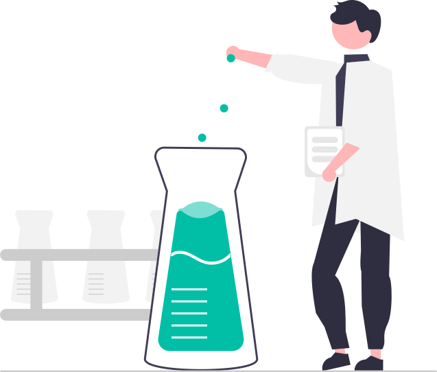

<!-- # Welcome to my profile 👋

I’m a student that enjoys using my programming skills for making people happy. And my dream is to become a software engineer :D

[Visit my website!](https://magoninho.github.io/)

## Bio

*   17 years old
*   2 years of experience
*   Fortaleza/CE - Brazil

# My stats

  
  

# Skills
## Languages
### I used

### I'm learning

### I'm going to learn

 

## Frameworks
### I used

### I'm learning

---

# Development Tools
## GNU/Linux 
### Distros

## My favorite text editors/IDEs
 -->

# Welcome to my profile! 

<samp>My name is Felipe, and I like programming.</samp>

## Bio
<samp>
I'm Felipe. A programmer enthusiast that is graduating Computer Science at UNIFOR, Fortaleza - Brazil. I'm a frontend developer but I'm very interested in learning backend development as well.
</samp>
 
 
<samp>
Not talking about the job market, though, I really enjoy learning about computer graphics. Some of my studies are uploaded to my <a href="https://www.youtube.com/@pythonista_4382">YouTube channel</a> where I try to spread this knowledge to people.
</samp>

<!--
# My experience

## Tech

## My favorite text editors/IDEs

   

# Ambitions

- Graduate Computer Science :computer:
- Become a teacher at university :man_teacher: 
- Become a software engineer :sunglasses:
- Live in a different country :airplane:
        
-->
# My stats

  
   
  

# Social

  
